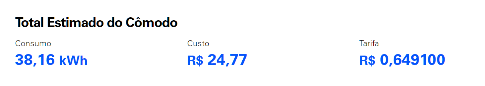

# UTN - Upload to NAS

## Introdução 
As férias finalmente começaram e eu me peguei pensando: o que posso fazer para aproveitar ao máximo esse tempo livre? A ideia de viajar até passou pela minha mente, mas decidi que era hora de dar um bom uso para aquele antigo PC de 2013 que estava jogado aqui em casa. Foi então que tive a brilhante ideia de transformá-lo em um servidor NAS.

## Configurações do computador
     Intel(R) Core(TM) i3 CPU 550 @ 3.20GHz
     Armazenamento de 580GB - 1HD de 500GB e outro de 80GB
     3GB RAM DDR2
     
### Escolha da distro
Na hora de escolher a distro para o meu NAS, me deparei com algumas distros como o [TrueNas](https://www.truenas.com/download-truenas-core/), porém os requisitos minimos para ter o TrueNas é de uma CPU 64bits e 8GB ram, porém meu humilde PC de 2013 é um 32Bits de 3GB ram, então decidi usar o [Open Media Vault](https://www.openmediavault.org/) que oferece suporte para computadores mais fracos.

## Meu NAS vs Clouds
Eu fiz esse projeto apenas com o propósito de estudar e compreender o funcionamento de um NAS, mas não tenho intenção de utilizá-lo como um servidor real. No futuro, planejo montar um NAS aprimorado, com peças melhores.

Entrei no site da Enel, companhia que fornece energia para São Paulo, e eles têm uma calculadora de consumo. Eu calculei o consumo do meu NAS usando o site [Power Suply](http://powersupplycalculator.net/) e com as configurações atuais ele gaste em média ~53W de potência. Se ele ficasse ligado 24 hrs por dia ficaria em um valor de 24 reais aqui em São Paulo.

### Resultado da calculadora: 

*Caso queria calcular seu consumo, [clique aqui](https://enel-sp.simuladordeconsumo.com.br/ambiente/escritorio)*

### Preço das Clouds
- 🍎 Preço do iCloud (**200GB**): R$14,90 /mês
- 👨‍💻 Preço do Google Drive(**200GB**): R$11,99 /mês
- 🪟 Preço do OneDrive (**100GB**): R$ 12,00 /mês
- 🗼 Preço do Meu NAS(**500GB**): R$24,77 /mês 

Resumindo, o meu servidor custaria quase o dobro por mês do que outras clouds, mas será que vale a pena? Veja os benefícios que pontuei e os malefícios e tire sua própria conclusão.

## Benefícios x Malefícios
### 🤓 Beneficios 
- Maior controle sobre meus dados
     - Eu literalmente posso manipular da maneira que eu quiser, até porque eu tenho total controle sobre o NAS.
- Segurança
     - Meus dados estão em um lugar seguro, na minha própia casa.
- Personalização
     - O famoso "faça você mesmo" vive quando se tem um NAS, faça do seu jeito.

### 😓 Malefícios
- Manutenção 
     - Às vezes, o barato sai caro. Se uma peça queimar, quebrar ou algo do tipo, quem é o responsável por trocar, arrumar, etc., sou eu mesmo.
- Depende da energia da minha casa
     - E se faltar luz e eu precisar acessar um documento importante? O que fazer...
- Acessibilidade
     - E se eu estiver longe de casa, o que fazer?

## Links importantes

- [O que é um NAS?](https://www.controle.net/faq/network-attached-storage-ou-storage-nas-o-que-e-e-para-que-serve) - Controle NET

- [OMV vs TRUENAS](https://www.reddit.com/r/OpenMediaVault/comments/xl5tiz/openmediavault_vs_truenas_scale/) - Reddit

- [Prós e contras de um NAS](https://www.techtudo.com.br/noticias/2017/09/servidor-domestico-veja-pros-e-contras-e-descubra-se-vale-a-pena-investir.ghtml) - TechTudo 
